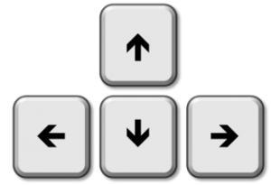
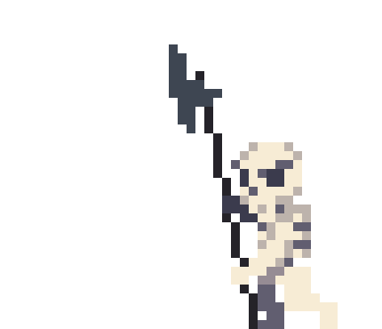

# MedieSlash made with `gdx2d` !

# Introduciton
MedieSlash is a Roguelike inspired by games like Brotato and The Binding of Isaac.

The aim of the game is to rid all the dungeons of mobs. Explore
the 5 randomly generated levels which contain more and more rooms
to win the game.

# How to play
Move your player with the arrow keys to avoid the mobs and aim. 

# Features
The game contains 2 different types of enemies.

## Player

The character you control. He constantly shoots fireballs in the direction he is walking. 

## Skeleton

The skeleton mob will chase you around the room and attack you once he is close enough.

## Warlock

The warlock mob stay put and shoot fireballs at you.

## Level Design

The game is seperated into 5 levels, each level containing at least 4 rooms. The higher
the level the more the rooms (+1 room per level).

The levels are randomly generated to never have the same layout.

Possible level 1 layout:
